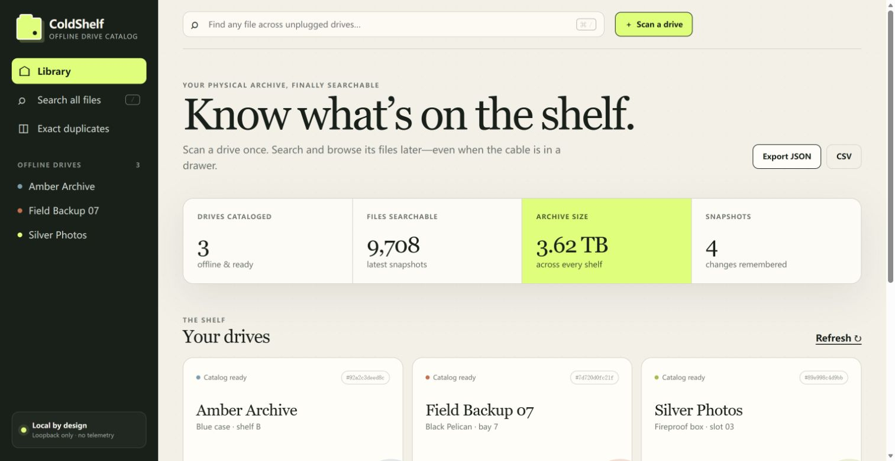
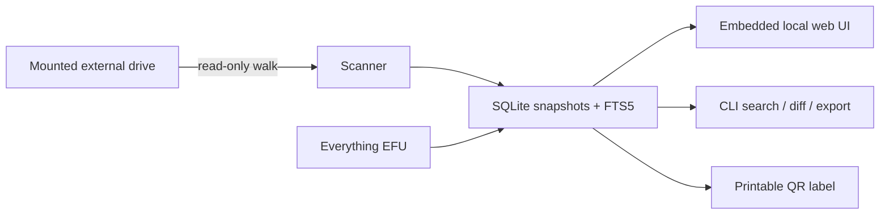

<div align="center">

# ColdShelf

### Know which unplugged drive holds your file.

**A private, cross-platform catalog for external drives that spend most of their life on a shelf.**

[](https://github.com/CAOShurong/coldshelf/actions/workflows/ci.yml)
[](https://github.com/CAOShurong/coldshelf/actions/workflows/codeql.yml)
[](https://github.com/CAOShurong/coldshelf/releases/latest)
[](LICENSE)
[](#privacy-and-safety)

</div>



You have twelve external disks, three plastic cases, and one question: *where did I put that file?* ColdShelf reads a mounted drive once and keeps a compact catalog of names, paths, sizes, timestamps, and optional fingerprints. Unplug the drive; search still works.

ColdShelf is one executable with an embedded local web interface. There is no server to assemble, no account, no Electron runtime, and no cloud copy of your catalog.

## What it does

- **Search every unplugged drive at once.** SQLite FTS5 indexes file names and complete paths.
- **Browse the original folder trees offline.** The catalog preserves paths, sizes, types, and modification times—not file contents.
- **Remember every rescan.** Compare the latest two snapshots to see additions, removals, and changes.
- **Prove exact duplicates.** Optional full SHA-256 scanning finds byte-for-byte copies across different drives. Quick fingerprints are never presented as proof.
- **Connect the database to the hardware.** Each drive gets a stable catalog ID and a printable, scannable QR label with its physical location.
- **Import an existing Everything index.** Windows users can ingest an [Everything File List (EFU)](docs/EFU_IMPORT.md) instead of rescanning.
- **Leave whenever you want.** Export the latest catalog as readable JSON or CSV.

## Quick start

Download the archive for your platform from [Releases](https://github.com/CAOShurong/coldshelf/releases/latest), verify it with the [installation guide](docs/INSTALL.md), extract it, then run:

```console
# Windows
coldshelf.exe scan "D:\" --name "Archive 01" --location "Blue case · shelf B"
coldshelf.exe serve --open

# macOS / Linux
./coldshelf scan /Volumes/Archive-01 --name "Archive 01" --location "Blue case · shelf B"
./coldshelf serve --open
```

`--open` opens `http://127.0.0.1:4877` in your default browser. Omit it for
background, service, or automated use: explicit `coldshelf serve` never launches
a browser. Running `coldshelf` with no subcommand remains the convenient
interactive shortcut and opens the interface. The server refuses non-loopback
addresses, so another device cannot read your catalog by accident.

You can also start from the interface: run `coldshelf`, choose **Scan a drive**, and enter its mounted path.

### Build from source

Go 1.25.12 or newer is enough; the browser interface is already embedded. The
patch-level minimum keeps release binaries on a Go standard library with the
current security fixes.

```console
git clone https://github.com/CAOShurong/coldshelf.git
cd coldshelf
go build -trimpath -o coldshelf ./cmd/coldshelf
./coldshelf demo --serve --open
```

The demo creates a disposable catalog with realistic offline-drive metadata. It does not create multi-terabyte fixture files.

## Pick the right scan mode

| Mode | Reads | Best for | Duplicate claim |
|---|---:|---|---|
| `none` | metadata only | fastest inventory of a large drive | none |
| `quick` | size + first/last 64 KiB | detecting likely changes without reading every byte | candidate only |
| `full` | every byte | archival verification and deduplication | exact SHA-256 match |

```console
coldshelf scan "D:\" --name "Camera masters" --hash full
coldshelf scan "D:\" --drive drv_a1b2c3d4e5f6 --hash quick
coldshelf scan "D:\" --drive "Camera masters" --exclude '$RECYCLE.BIN/**'
```

ColdShelf never follows symbolic links and never writes to the scanned path. Permission failures are counted and shown instead of aborting the entire inventory.

## Command line

```text
coldshelf serve [--db PATH] [--listen 127.0.0.1:4877] [--open]
coldshelf scan PATH [--name NAME] [--drive ID] [--hash none|quick|full]
coldshelf search QUERY [--drive ID] [--json]
coldshelf drives [--json]
coldshelf diff DRIVE --from SNAPSHOT --to SNAPSHOT [--json]
coldshelf label DRIVE [--out label.svg]
coldshelf export [--format json|csv] [--out FILE]
coldshelf import-efu FILE --name NAME [--strip-prefix PATH]
coldshelf demo [--db FILE] [--serve] [--open]
```

Flags may appear before or after positional arguments, so both `scan --hash full D:\` and `scan D:\ --hash full` work.

## The catalog is deliberately boring

ColdShelf stores one SQLite database in your normal user configuration folder:

| Platform | Default catalog |
|---|---|
| Windows | `%AppData%\ColdShelf\coldshelf.db` |
| macOS | `~/Library/Application Support/ColdShelf/coldshelf.db` |
| Linux | `$XDG_CONFIG_HOME/ColdShelf/coldshelf.db` (or `~/.config/ColdShelf/coldshelf.db`) |

Use `--db PATH` on any command to keep a separate catalog or place it in your backup set. WAL mode keeps reads responsive during a scan; each completed snapshot is committed atomically.



Read the [architecture](docs/ARCHITECTURE.md) for the schema and failure model.

## Privacy and safety

- The default server listens only on `127.0.0.1`; non-loopback binding is rejected.
- Host-header and cross-origin checks reduce browser-based attacks against the local API.
- A restrictive Content Security Policy blocks remote scripts, fonts, images, frames, and network calls.
- There is no telemetry, analytics, updater, login, cloud sync, or hidden network request.
- Scans use filesystem metadata and optional file reads. They never rename, modify, delete, or move source files.
- ColdShelf stores names and paths. Those can still be sensitive, so protect and back up the database as you would any local index.

The detailed boundary is in the [threat model](docs/THREAT_MODEL.md). Please report vulnerabilities according to [SECURITY.md](SECURITY.md), not in a public issue.

Runtime dependency licenses are collected in [third-party notices](THIRD_PARTY_NOTICES.md) and shipped inside every release archive.

## Why another disk catalog?

Offline cataloging is an old problem with renewed demand. People still ask for a modern way to search disconnected drives, especially a cross-platform or web-based one. Mature desktop catalogs remain useful, while newer polished products often target macOS or assume a persistent server.

ColdShelf focuses on a narrower combination:

1. one auditable cross-platform binary;
2. a modern browser interface without a browser extension or hosted service;
3. snapshot history and honest hash semantics;
4. physical-location notes and QR labels as first-class data;
5. open exports and an EFU migration path.

It is not a file manager, backup program, recovery tool, media preview generator, or replacement for an always-online NAS. It helps you locate the right offline media before you plug it in.

## Project status

The `v0.1.x` line is an early public release. The on-disk schema is versioned, but backwards compatibility is not promised until `v1.0.0`. Before upgrading, copy the database or export JSON.

Planned work is tracked in [ROADMAP.md](ROADMAP.md). The highest-value next steps are catalog import/merge, optional thumbnails with strict size limits, scanner benchmarks on multi-million-entry drives, and a properly authenticated remote mode.

## Contributing

Bug reports, platform tests, import samples with private paths removed, and focused pull requests are welcome. Start with [CONTRIBUTING.md](CONTRIBUTING.md); the repository includes a demo catalog generator, tests for every core package, multi-platform CI, CodeQL, checksums, and release SBOMs.

ColdShelf is available under the [MIT License](LICENSE).
